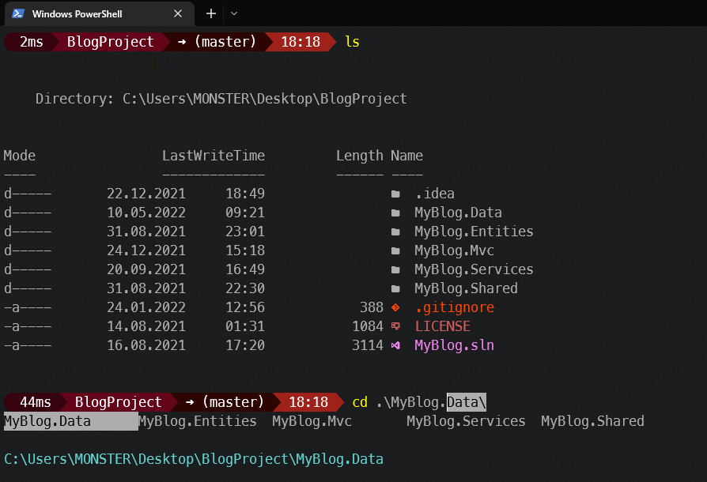

*****Created by editing the M365 Princess.omp.json file.*****

[M365 Princess](https://github.com/JanDeDobbeleer/oh-my-posh/blob/main/themes/M365Princess.omp.json)

[My Theme](myConfig.omp.json)

[Other themes](https://ohmyposh.dev/docs/themes)

## Installation

[Ohmyposh installation](https://ohmyposh.dev/docs/installation/windows)

[PSReadline installation](https://github.com/PowerShell/PSReadLine)

##### - Replace **THEME.PATH** in the **PS1** file with your theme path.

##### - You can change your own powershell config by typing _Code (or any editor) $PROFILE_ in your terminal. [PS1_File](Microsoft.PowerShell_profile.ps1)

## Images

#### Appearance & Autocomplete

#### Autocomplete by History
